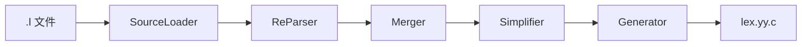
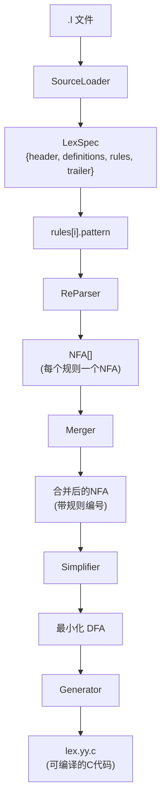

# SeuLex 词法分析器生成器

## 实验中期报告

---

**课程名称**：编译原理  
**实验项目名称**：SeuLex 词法分析器生成器的设计与实现  
**学生姓名**：[姓名]  
**学号**：[学号]  
**专业**：[专业]  
**完成日期**：2026年4月

---

## 目录

1. [引言](#1-引言)
2. [系统架构设计](#2-系统架构设计)
   - 2.1 总体架构
   - 2.2 模块划分
   - 2.3 数据流分析
3. [数据结构设计](#3-数据结构设计)
   - 3.1 输入数据结构
   - 3.2 NFA 数据结构
   - 3.3 DFA 数据结构
   - 3.4 辅助数据结构
4. [核心算法伪代码](#4-核心算法伪代码)
   - 4.1 Thompson 构造法
   - 4.2 子集构造法
   - 4.3 Hopcroft 最小化算法
   - 4.4 代码生成算法
5. [核心类接口设计](#5-核心类接口设计)
   - 5.1 SourceLoader 模块
   - 5.2 ReParser 模块
   - 5.3 Merger 模块
   - 5.4 Simplifier 模块
   - 5.5 Generator 模块
6. [系统测试设计](#6-系统测试设计)
   - 6.1 测试策略
   - 6.2 单元测试设计
   - 6.3 集成测试设计
   - 6.4 测试覆盖率目标
7. [总结与展望](#7-总结与展望)

---

## 1. 引言

### 1.1 项目背景

词法分析是编译过程的第一个阶段，负责将源代码字符流转换为单词（Token）序列。手工编写词法分析器繁琐且易出错，因此词法分析器生成器应运而生。Flex 是目前广泛使用的词法分析器生成器，但其代码复杂、文档分散，不便于学习和二次开发。

本项目旨在设计和实现一个简化版的词法分析器生成器 **SeuLex**，采用 TypeScript 语言实现，支持类 Flex 的语法规范，能够根据正则表达式规则生成对应的 C 语言词法分析器。

### 1.2 项目目标

1. **支持类 Flex 的语法规范**：能够解析 `.l` 文件，支持宏定义、正则表达式规则和动作代码
2. **完整的 NFA/DFA 转换流程**：实现 Thompson 构造法、子集构造法和 DFA 最小化
3. **生成可编译的 C 代码**：输出符合标准 C 语法的词法分析器源代码
4. **模块化设计**：各模块职责清晰，便于测试和维护

### 1.3 技术选型

- **实现语言**：TypeScript
- **目标输出**：C 语言
- **字符编码**：8-bit 字节流（0-255）
- **测试框架**：Vitest

---

## 2. 系统架构设计

### 2.1 总体架构

SeuLex 采用**流水线架构**，输入为 `.l` 文件，经过五个模块的串行处理，最终输出 C 语言代码：



**设计原则**：
- **单一职责**：每个模块只负责一个核心功能
- **数据驱动**：模块间通过明确的数据结构传递信息
- **可测试性**：每个模块可独立测试

### 2.2 模块划分

| 模块 | 输入 | 输出 | 核心功能 | 复杂度 |
|------|------|------|----------|--------|
| **SourceLoader** | `.l` 文件路径 | `LexSpec` 对象 | 解析三段式结构，展开宏定义 | O(n) |
| **ReParser** | 正则表达式字符串 | `NFA` 对象 | 正则解析 → AST → NFA | O(|r|) |
| **Merger** | NFA 列表 | 单一 NFA | 合并多个 NFA | O(n) |
| **Simplifier** | NFA | 最小化 DFA | NFA→DFA→最小化 | O(2ⁿ) |
| **Generator** | DFA + LexSpec | `.c` 文件 | 生成 C 代码 | O(m) |

### 2.3 数据流分析



**数据流特点**：
1. **单向流动**：数据从输入到输出单向传递，无循环依赖
2. **中间表示**：NFA 和 DFA 是核心的中间表示形式
3. **延迟展开**：宏定义在 SourceLoader 阶段展开，正则表达式在 ReParser 阶段处理

---

## 3. 数据结构设计

### 3.1 输入数据结构

#### 3.1.1 LexSpec（源文件规范）

```typescript
interface LexSpec {
    header: string;           // %{ %} 中的内容
    definitions: Definition[]; // 宏定义列表
    rules: Rule[];           // 规则列表
    trailer: string;         // %% 之后的内容
}

interface Definition {
    name: string;        // 宏名称，如 "DIGIT"
    definition: string;  // 宏定义，如 "[0-9]"
}

interface Rule {
    pattern: string;     // 展开后的正则表达式
    action: string;      // 动作代码（{...} 中的内容）
    lineNo: number;      // 在源文件中的行号
    priority: number;    // 优先级（数值越小优先级越高）
}
```

**设计说明**：
- `priority` 按规则定义顺序从 0 开始递增，用于解决冲突
- `pattern` 在解析时已展开宏定义，如 `{DIGIT}+` 展开为 `[0-9]+`

### 3.2 NFA 数据结构

#### 3.2.1 NFA（非确定有限自动机）

```typescript
class NFA {
    start: State;           // 起始状态
    accept: State;          // 接受状态
    states: State[];        // 所有状态
    private stateCounter: number;  // 状态 ID 计数器

    constructor(start?: State, accept?: State, states?: State[]);
    newState(): State;      // 创建新状态
    clone(): NFA;           // 深拷贝（用于正闭包）
}

class State {
    id: number;                    // 唯一标识符
    transitions: Transition[];     // 出边转移列表
    isAccept: boolean;             // 是否为接受状态
    acceptRule: number;            // 接受的规则编号（-1 表示未设置）
}

type Transition =
    | { type: 'epsilon'; to: State }           // ε-转移
    | { type: 'char'; char: number; to: State }   // 字符转移
    | { type: 'class'; class: CharClass; to: State };  // 字符类转移
```

#### 3.2.2 CharClass（字符类）

```typescript
interface CharClass {
    negated: boolean;           // 是否取反 [^...]
    ranges: [number, number][]; // 范围列表，如 [['a','z']]
    singles: number[];          // 单字符列表
}
```

**设计说明**：
- 字符转移和字符类转移分开表示，避免字符类展开导致的 NFA 状态膨胀
- 字符使用 0-255 的数值表示，对应 8-bit 字节

### 3.3 DFA 数据结构

```typescript
class DFA {
    states: DFAState[];       // 所有状态
    startStateId: number;     // 起始状态 ID
    private stateCounter: number;

    addState(nfaStates: Set<State>): number;  // 添加新状态
    getTransition(stateId: number, char: number): number | null;
    setTransition(fromId: number, char: number, toId: number): void;
}

class DFAState {
    id: number;                      // 状态 ID（数组索引）
    nfaStates: Set<State>;           // 对应的 NFA 状态集合（构造时使用）
    transitions: Int16Array;         // 转移表（大小 256，-1 表示无转移）
    isAccept: boolean;               // 是否为接受状态
    acceptRule: number;              // 接受的规则编号（数值越小优先级越高）
}
```

**设计说明**：
- `transitions` 使用 `Int16Array(256)`，每个状态占用 512 字节
- `nfaStates` 仅在 DFA 构造时使用，构造完成后可释放

### 3.4 辅助数据结构

```typescript
// 状态集合的唯一键（用于 Map 去重）
function setKey(states: Set<State>): string;

// 队列（BFS 使用）
class Queue<T> {
    enqueue(item: T): void;
    dequeue(): T | undefined;
    isEmpty(): boolean;
}

// 栈（DFS / ε-闭包使用）
class Stack<T> {
    push(item: T): void;
    pop(): T | undefined;
    isEmpty(): boolean;
}
```

---

## 4. 核心算法伪代码

### 4.1 Thompson 构造法

**功能**：将正则表达式 AST 转换为 NFA  
**时间复杂度**：O(|r|)，其中 |r| 为正则表达式长度  
**空间复杂度**：O(|r|)

#### 4.1.1 基本构造规则

```typescript
// 构造单个字符的 NFA
function buildChar(char: number): NFA {
    const nfa = new NFA();
    const start = nfa.newState();
    const accept = nfa.newState();
    
    start.transitions.push({ type: 'char', char, to: accept });
    accept.isAccept = true;
    
    nfa.start = start;
    nfa.accept = accept;
    nfa.states = [start, accept];
    return nfa;
}

// 连接两个 NFA (ab)
function buildConcat(a: NFA, b: NFA): NFA {
    a.accept.transitions.push({ type: 'epsilon', to: b.start });
    a.accept.isAccept = false;
    return new NFA(a.start, b.accept, [...a.states, ...b.states]);
}

// 并运算 (a|b)
function buildUnion(a: NFA, b: NFA): NFA {
    const nfa = new NFA();
    const start = nfa.newState();
    const accept = nfa.newState();
    
    start.transitions.push({ type: 'epsilon', to: a.start });
    start.transitions.push({ type: 'epsilon', to: b.start });
    a.accept.transitions.push({ type: 'epsilon', to: accept });
    b.accept.transitions.push({ type: 'epsilon', to: accept });
    
    a.accept.isAccept = false;
    b.accept.isAccept = false;
    accept.isAccept = true;
    
    nfa.start = start;
    nfa.accept = accept;
    nfa.states = [start, accept, ...a.states, ...b.states];
    return nfa;
}

// 闭包 (a*)
function buildStar(a: NFA): NFA {
    const nfa = new NFA();
    const start = nfa.newState();
    const accept = nfa.newState();
    
    start.transitions.push({ type: 'epsilon', to: a.start });
    start.transitions.push({ type: 'epsilon', to: accept });
    a.accept.transitions.push({ type: 'epsilon', to: a.start });
    a.accept.transitions.push({ type: 'epsilon', to: accept });
    
    a.accept.isAccept = false;
    accept.isAccept = true;
    
    nfa.start = start;
    nfa.accept = accept;
    nfa.states = [start, accept, ...a.states];
    return nfa;
}
```

#### 4.1.2 从 AST 构造 NFA

```typescript
function buildFromAST(ast: RegexAST): NFA {
    switch (ast.type) {
        case 'char':    return buildChar(ast.char);
        case 'class':   return buildClass(ast.class);
        case 'any':     return buildClass({ negated: false, ranges: [[0,255]], singles: [] });
        case 'concat':  return buildConcat(buildFromAST(ast.left), buildFromAST(ast.right));
        case 'union':   return buildUnion(buildFromAST(ast.left), buildFromAST(ast.right));
        case 'star':    return buildStar(buildFromAST(ast.child));
        case 'plus':    return buildPlus(buildFromAST(ast.child));
        case 'optional':return buildOptional(buildFromAST(ast.child));
        case 'range':   return buildRange(buildFromAST(ast.child), ast.min, ast.max);
    }
}
```

### 4.2 子集构造法

**功能**：将 NFA 转换为等价的 DFA  
**时间复杂度**：O(2ⁿ)，最坏情况（n 为 NFA 状态数）  
**空间复杂度**：O(2ⁿ)  
**优化**：惰性构造，仅构造可达状态

```typescript
function subsetConstruction(nfa: NFA): DFA {
    const dfa = new DFA();
    const visited = new Map<string, number>();  // 状态集合 → DFA状态ID
    const worklist: Set<State>[] = [];
    
    // 初始状态 = NFA 起始状态的 ε-闭包
    const startSet = epsilonClosure(new Set([nfa.start]));
    const startId = dfa.addState(startSet);
    dfa.startStateId = startId;
    worklist.push(startSet);
    visited.set(setKey(startSet), startId);
    
    while (worklist.length > 0) {
        const current = worklist.shift()!;
        const fromId = visited.get(setKey(current))!;
        
        // 标记接受状态（取优先级最高的规则）
        let acceptRule = -1;
        for (const state of current) {
            if (state.isAccept) {
                if (acceptRule === -1 || state.acceptRule < acceptRule) {
                    acceptRule = state.acceptRule;
                }
            }
        }
        dfa.states[fromId].isAccept = acceptRule !== -1;
        dfa.states[fromId].acceptRule = acceptRule;
        
        // 处理每个可能的输入字符
        const chars = collectPossibleChars(current);
        for (const char of chars) {
            const next = epsilonClosure(move(current, char));
            if (next.size === 0) {
                dfa.states[fromId].transitions[char] = -1;
                continue;
            }
            
            const key = setKey(next);
            let toId = visited.get(key);
            if (toId === undefined) {
                toId = dfa.addState(next);
                visited.set(key, toId);
                worklist.push(next);
            }
            dfa.states[fromId].transitions[char] = toId;
        }
    }
    return dfa;
}

// ε-闭包：通过 ε-转移可达的所有状态
function epsilonClosure(states: Set<State>): Set<State> {
    const stack = Array.from(states);
    const closure = new Set(states);
    
    while (stack.length > 0) {
        const state = stack.pop()!;
        for (const trans of state.transitions) {
            if (trans.type === 'epsilon' && !closure.has(trans.to)) {
                closure.add(trans.to);
                stack.push(trans.to);
            }
        }
    }
    return closure;
}

// Move：从状态集通过字符 c 直接到达的状态
function move(states: Set<State>, char: number): Set<State> {
    const result = new Set<State>();
    for (const state of states) {
        for (const trans of state.transitions) {
            if (trans.type === 'char' && trans.char === char) {
                result.add(trans.to);
            } else if (trans.type === 'class' && matchesClass(char, trans.class)) {
                result.add(trans.to);
            }
        }
    }
    return result;
}
```

### 4.3 Hopcroft 最小化算法

**功能**：将 DFA 状态最小化，合并等价状态  
**时间复杂度**：O(n log n)，其中 n 为 DFA 状态数  
**空间复杂度**：O(n)

```typescript
function minimize(dfa: DFA): DFA {
    // 初始化分区：按 acceptRule 分组的接受状态 + 非接受状态
    const partition = new Map<number, number>();
    const groups: Set<number>[] = [];
    
    // 按 acceptRule 分组接受状态
    const acceptByRule = new Map<number, Set<number>>();
    const nonAcceptStates = new Set<number>();
    
    for (const state of dfa.states) {
        if (state.isAccept) {
            if (!acceptByRule.has(state.acceptRule)) {
                acceptByRule.set(state.acceptRule, new Set());
            }
            acceptByRule.get(state.acceptRule)!.add(state.id);
        } else {
            nonAcceptStates.add(state.id);
        }
    }
    
    // 初始化组
    let groupId = 0;
    for (const [ruleId, states] of acceptByRule) {
        groups.push(states);
        for (const stateId of states) partition.set(stateId, groupId);
        groupId++;
    }
    if (nonAcceptStates.size > 0) {
        groups.push(nonAcceptStates);
        for (const stateId of nonAcceptStates) partition.set(stateId, groupId);
    }
    
    // Hopcroft 算法主循环
    const worklist = new Set<number>(groups.keys());
    while (worklist.size > 0) {
        const A = worklist.values().next().value!;
        worklist.delete(A);
        
        for (let c = 0; c < 256; c++) {
            // 找到通过 c 转移到 A 的状态
            const X = new Set<number>();
            for (const stateId of partition.keys()) {
                const nextId = dfa.states[stateId].transitions[c];
                if (nextId !== -1 && partition.get(nextId) === A) {
                    X.add(stateId);
                }
            }
            if (X.size === 0) continue;
            
            // 分裂组
            for (let g = 0; g < groups.length; g++) {
                const group = groups[g];
                const inter = new Set(group).intersection(X);
                const diff = new Set(group).difference(X);
                
                if (inter.size === 0 || diff.size === 0) continue;
                
                // 较小的组留在原位，较大的组放入新组
                if (inter.size <= diff.size) {
                    groups[g] = inter;
                    const newG = groups.length;
                    groups.push(diff);
                    // 更新 partition...
                    if (!worklist.has(g)) worklist.add(g);
                } else {
                    groups[g] = diff;
                    const newG = groups.length;
                    groups.push(inter);
                    // 更新 partition...
                    if (!worklist.has(g)) worklist.add(newG);
                }
            }
        }
    }
    
    return rebuildDFA(dfa, partition, groups);
}
```

### 4.4 代码生成算法

**功能**：将 DFA 转换为可编译的 C 代码

```typescript
function generateToString(dfa: DFA, spec: LexSpec): string {
    return `/* Generated by SeuLex */
#include <stdio.h>
#include <stdlib.h>
#include <string.h>

/* User Header */
${spec.header}

#define YY_NUM_STATES ${dfa.states.length}
#define YY_NUM_RULES ${spec.rules.length}

/* Transition Table */
static const int yy_next[YY_NUM_STATES][256] = {
    ${generateTransitionTable(dfa)}
};

/* Accept Table */
static const int yy_accept[YY_NUM_STATES] = {
    ${dfa.states.map(s => s.acceptRule + 1).join(', ')}
};

/* Lexer Function */
int yylex(void) {
    int state = ${dfa.startStateId};
    // ... 状态机逻辑
    while (1) {
        int c = yy_getchar();
        int next = (c == EOF) ? -1 : yy_next[state][c];
        if (next == -1) {
            // 处理接受或错误
            if (yy_accept[state]) {
                switch (yy_accept[state]) {
                    ${spec.rules.map((r, i) => `case ${i+1}: { ${r.action} }`).join('\n')}
                }
            }
        }
        state = next;
    }
}

/* User Code */
${spec.trailer}
`;
}
```

---

## 5. 核心类接口设计

### 5.1 SourceLoader 模块

```typescript
// 加载并解析 .l 文件
export function load(filename: string): LexSpec;

// 从字符串加载（用于测试）
export function loadFromString(content: string, filename?: string): LexSpec;

// 展开宏定义
export function expandMacros(
    pattern: string, 
    definitions: Definition[]
): string;
```

**错误处理**：
- `LexerSpecError`：.l 文件格式错误，包含行号和列号

### 5.2 ReParser 模块

```typescript
// 主入口：将正则表达式解析为 NFA
export function parse(pattern: string): NFA;

// 内部组件
export class RegexLexer {
    constructor(input: string);
    nextToken(): RegexToken;
}

export class RegexParser {
    constructor(lexer: RegexLexer);
    parse(): RegexAST;
}

export class NFABuilder {
    buildFromAST(ast: RegexAST): NFA;
    buildChar(char: number): NFA;
    buildClass(cls: CharClass): NFA;
    buildConcat(a: NFA, b: NFA): NFA;
    buildUnion(a: NFA, b: NFA): NFA;
    buildStar(a: NFA): NFA;
    buildPlus(a: NFA): NFA;
    buildOptional(a: NFA): NFA;
    buildRange(a: NFA, min: number, max: number | null): NFA;
}
```

**错误处理**：
- `RegexParseError`：正则语法错误，包含位置信息

### 5.3 Merger 模块

```typescript
// 将多个 NFA 合并为一个
export function merge(nfas: NFA[], rules: Rule[]): NFA;

// 合并信息（调试用）
export interface MergedNFAInfo {
    originalCount: number;  // 原始 NFA 数量
    totalStates: number;    // 合并后总状态数
    acceptStates: number;   // 接受状态数
}

export function getMergeInfo(nfa: NFA): MergedNFAInfo;
```

### 5.4 Simplifier 模块

```typescript
// 主入口：NFA → DFA → 最小化
export function simplify(nfa: NFA): DFA;

// 子步骤（可单独测试）
export function subsetConstruction(nfa: NFA): DFA;
export function minimize(dfa: DFA): DFA;
export function epsilonClosure(states: Set<State>): Set<State>;
export function move(states: Set<State>, char: number): Set<State>;

// 简化信息
export interface SimplifyInfo {
    nfaStates: number;
    dfaStatesBefore: number;
    dfaStatesAfter: number;
    compressionRatio: number;
}
```

### 5.5 Generator 模块

```typescript
// 生成 C 代码
export function generate(
    dfa: DFA, 
    spec: LexSpec, 
    outputFile: string
): Promise<void>;

// 生成到字符串（用于测试）
export function generateToString(dfa: DFA, spec: LexSpec): string;

// 带选项的生成
export interface GenerateOptions {
    compressTables: boolean;  // 默认 true
    debug: boolean;           // 默认 false
    functionName: string;     // 默认 "yylex"
}

export function generateWithOptions(
    dfa: DFA,
    spec: LexSpec,
    outputFile: string,
    options: Partial<GenerateOptions>
): Promise<void>;
```

---

## 6. 系统测试设计

### 6.1 测试策略

采用**分层测试**策略：
1. **单元测试**：每个模块独立测试
2. **集成测试**：模块间组合测试
3. **端到端测试**：完整编译流程测试
4. **边界测试**：异常输入和极端情况

### 6.2 单元测试设计

#### SourceLoader 测试

| 测试项 | 输入 | 预期输出 | 测试目的 |
|--------|------|----------|----------|
| 基本解析 | `%%\na { return 1; }\n%%` | 1条规则 | 验证基本功能 |
| 宏展开 | `DIGIT [0-9]` + `{DIGIT}+` | `[0-9]+` | 验证宏展开 |
| 嵌套宏 | `A {B}`, `B {C}` | 递归展开 | 验证嵌套展开 |
| 错误处理 | 缺少 `%%` | 抛出异常 | 验证错误检测 |

#### ReParser 测试

| 测试项 | 输入 | 验证点 |
|--------|------|--------|
| 单个字符 | `a` | NFA 有2个状态 |
| 字符类 | `[a-z]` | 使用 class 转移 |
| 闭包 | `a*` | 有 ε-转移允许空匹配 |
| 连接 | `ab` | 状态数正确 |
| 或运算 | `a\|b` | 起始状态有2个 ε-转移 |
| 转义 | `\\n` | 字符值为10 |
| 错误 | `(a` | 抛出 RegexParseError |

#### Simplifier 测试

| 测试项 | 输入 | 验证点 |
|--------|------|--------|
| ε-闭包 | 单状态带 ε-转移 | 包含所有可达状态 |
| Move | 状态集 + 字符 | 正确计算出边 |
| NFA→DFA | 简单 NFA | 正确构造等价 DFA |
| DFA 最小化 | 有冗余状态的 DFA | 状态数减少 |

### 6.3 集成测试设计

#### 测试用例 1：简单计算器

```
%%
[0-9]+          { return NUMBER; }
[+\-*/]         { return OP; }
[ \t\n]+        { /* ignore */ }
.               { return ERROR; }
%%
```

验证：
- 数字正则 `[0-9]+` 正确匹配
- 运算符 `[+\-*/]` 正确识别
- 空白字符被忽略
- 非法字符触发错误

#### 测试用例 2：标识符识别

```
%%
"if"            { return IF; }
[a-z]+          { return IDENT; }
%%
```

验证：
- 输入 "if" 优先匹配关键字（规则0）而非标识符（规则1）
- 输入 "identifier" 匹配标识符规则

#### 测试用例 3：完整流程

从 `.l` 文件到可编译 C 代码的完整流程：
1. 解析 `.l` 文件
2. 生成 NFA
3. 合并 NFA
4. NFA→DFA→最小化
5. 生成 C 代码
6. 验证 C 代码可编译

### 6.4 测试覆盖率目标

| 模块 | 目标覆盖率 | 关键路径 |
|------|-----------|----------|
| SourceLoader | 90% | 宏展开、错误处理 |
| ReParser | 90% | 所有正则操作符 |
| Merger | 85% | 多 NFA 合并 |
| Simplifier | 85% | ε-闭包、Hopcroft |
| Generator | 80% | 代码模板生成 |

---

## 7. 总结与展望

### 7.1 已完成工作

1. **架构设计**：完成了五模块流水线架构设计，明确了各模块职责和数据流
2. **数据结构设计**：定义了 LexSpec、NFA、DFA 等核心数据结构
3. **算法设计**：完成了 Thompson 构造、子集构造、Hopcroft 最小化等核心算法的伪代码
4. **接口设计**：明确了各模块的对外接口和错误处理机制
5. **测试设计**：制定了分层测试策略和详细测试用例

### 7.2 待完成工作

1. **模块实现**：
   - SourceLoader 的 `.l` 文件解析器
   - ReParser 的正则词法/语法分析器
   - Simplifier 的子集构造和 Hopcroft 算法实现
   - Generator 的 C 代码生成器

2. **测试实施**：
   - 编写单元测试代码
   - 编写集成测试代码
   - 测试覆盖率达标

3. **优化工作**：
   - DFA 转移表压缩
   - 错误信息优化
   - 性能优化

4. **文档完善**：
   - 用户手册
   - API 文档
   - 示例程序

### 7.3 技术难点

1. **正则表达式解析**：需要正确处理运算符优先级和括号嵌套
2. **Hopcroft 算法**：实现细节复杂，需要仔细验证正确性
3. **代码生成**：生成符合标准 C 语法且可编译的代码

### 7.4 预期成果

完成一个可用的词法分析器生成器，能够：
- 解析类 Flex 的 `.l` 文件
- 生成优化的词法分析器 C 代码
- 通过完整的测试套件
- 提供清晰的使用文档

---

**附录**：完整 SPEC 文档位于 `/home/cyh/seu_lex/spec/` 目录下。
