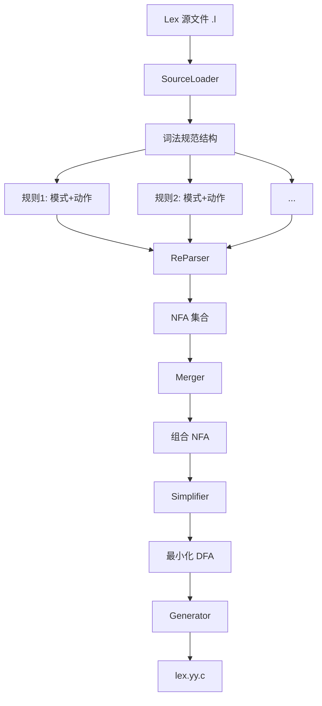

# SeuLex 词法分析器生成器

## 编译原理实践项目结项报告

---

**项目名称**: SeuLex - Flex 兼容的词法分析器生成器  
**课程名称**: 编译原理  
**学生姓名**: 陈昱衡  
**学号**: 71123302  
**专业**: 软件工程  
**完成日期**: 2026年5月  
**项目分工**: 负责 Lexer 部分（词法分析器生成器的设计与实现）

---

## 目录

1. [项目概述](#1-项目概述)
2. [系统设计](#2-系统设计)
3. [模块实现](#3-模块实现)
4. [核心算法详解](#4-核心算法详解)
5. [测试策略与验证](#5-测试策略与验证)
6. [与其他模块的集成](#6-与其他模块的集成)
7. [项目成果与评估](#7-项目成果与评估)
8. [AI工具在项目开发中的应用](#8-ai工具在项目开发中的应用)
9. [总结与展望](#9-总结与展望)
10. [附录](#10-附录)
    - 10.1 [项目文件结构](#101-项目文件结构)
    - 10.2 [构建与运行](#102-构建与运行)
    - 10.3 [参考文献](#103-参考文献)
    - 10.4 [完整的 AI 辅助开发交互记录](#104-完整的-ai-辅助开发交互记录)

---

## 1. 项目概述

### 1.1 项目背景

在编译原理实践中，词法分析是将源代码转换为 token 序列的关键步骤。本项目实现了一个与 Flex 兼容的词法分析器生成器 SeuLex，能够将 `.l` 格式的词法规范文件转换为可编译的 C 代码。

### 1.2 项目目标

- 实现一个功能完整的词法分析器生成器
- 支持 Flex 规范的 `.l` 文件格式
- 生成高效、可读性强的 C 代码
- 通过广泛的测试验证正确性
- 与 yacc 生成的解析器无缝集成

### 1.3 技术栈

- **实现语言**: TypeScript（开发）→ 生成 C 代码
- **测试框架**: Vitest
- **编译工具**: GCC
- **对比验证**: Flex（官方实现）、CSmith（随机程序生成）

### 1.4 项目规模

- **源代码**: 约 4,104 行 TypeScript 代码
- **测试代码**: 约 1,200+ 行测试代码
- **测试用例**: 310+ 个测试用例，涵盖单元测试、集成测试、端到端测试
- **测试 Fixtures**: 6 组独立的词法分析器测试用例

---

## 2. 系统设计

### 2.1 系统架构

SeuLex 采用管道（Pipeline）架构，数据单向流动，各模块职责清晰：

**模块流水线**：

| 阶段 | 模块 | 输入 | 输出 | 处理内容 |
|------|------|------|------|----------|
| 1 | **SourceLoader** | `.l` 文件路径 | 结构化词法规范 | 加载和解析词法规范文件 |
| 2 | **ReParser** | 正则模式字符串 | NFA（ε-NFA）| 解析正则表达式，构造 NFA |
| 3 | **Merger** | NFA 数组 + 规则信息 | 组合 NFA | 合并所有 NFA 为一个整体 |
| 4 | **Simplifier** | NFA | 最小化 DFA | NFA 转 DFA 并最小化 |
| 5 | **Generator** | DFA + 规范 | C 代码 | 生成可编译的词法分析器代码 |

**数据流向**：SourceLoader → ReParser → Merger → Simplifier → Generator → lex.yy.c

### 2.2 模块划分

| 模块 | 职责 | 输入 | 输出 |
|------|------|------|------|
| **SourceLoader** | 加载和解析 `.l` 文件 | `.l` 文件路径 | 结构化词法规范 |
| **ReParser** | 解析正则表达式 | 正则模式字符串 | NFA（ε-NFA）|
| **Merger** | 合并多个 NFA | NFA 数组 + 规则信息 | 组合 NFA |
| **Simplifier** | 优化自动机 | NFA | 最小化 DFA |
| **Generator** | 生成目标代码 | DFA + 规范 | C 代码 |

### 2.3 数据流分析



---

## 3. 模块实现

### 3.1 SourceLoader 模块

**功能**: 加载 Flex 格式的 `.l` 文件，解析为内部数据结构。

**支持的特性**:
- 定义段（宏定义）
- 规则段（正则模式 + C 代码动作）
- 用户代码段（复制到输出）
- 头文件包含（`%{ ... %}`）
- 宏展开（`{NAME}` 替换）
- 转义序列处理（`\n`, `\t`, `"` 等）

**代码示例**:
```typescript
export function load(filename: string): LexSpec {
    const content = readFileSync(filename, 'utf-8');
    return loadFromString(content, filename);
}

export function loadFromString(content: string, filename?: string): LexSpec {
    // 标准化换行符
    const normalized = content.replace(/\r\n/g, '\n');
    const lines = normalized.split('\n');
    
    // 解析 %% 分隔符
    // 解析定义段、规则段、用户代码段
    // 展开宏定义
}
```

### 3.2 ReParser 模块

**功能**: 使用 Thompson 构造法将正则表达式转换为 NFA。

**支持的正则表达式特性**:
- 字符匹配（字面量）
- 字符类（`[a-z]`, `[0-9]`）
- 取反字符类（`[^a-z]`）
- 可选（`?`）
- 重复（`*`, `+`）
- 并置（连接）
- 选择（`|`）
- 分组（`(...)`）
- 转义字符（`\.`, `\*`, `\+` 等）

**Thompson 构造核心**:
```typescript
// 基本字符 NFA
function createCharNFA(char: string): NFA {
    const start = newState();
    const accept = newState();
    addTransition(start, char, accept);
    return { start, accept, states: [start, accept] };
}

// 选择构造 (A|B)
function createUnionNFA(nfa1: NFA, nfa2: NFA): NFA {
    const start = newState();
    const accept = newState();
    addEpsilonTransition(start, nfa1.start);
    addEpsilonTransition(start, nfa2.start);
    addEpsilonTransition(nfa1.accept, accept);
    addEpsilonTransition(nfa2.accept, accept);
    return { start, accept, states: [...nfa1.states, ...nfa2.states, start, accept] };
}

// Kleene 星 (A*)
function createStarNFA(nfa: NFA): NFA {
    const start = newState();
    const accept = newState();
    addEpsilonTransition(start, accept);  // 空匹配
    addEpsilonTransition(start, nfa.start);
    addEpsilonTransition(nfa.accept, nfa.start);  // 循环
    addEpsilonTransition(nfa.accept, accept);
    return { start, accept, states: [...nfa.states, start, accept] };
}
```

### 3.3 Merger 模块

**功能**: 将多个规则的 NFA 合并为单个组合 NFA，支持规则优先级。

**关键设计**:
- 添加新的起始状态
- 通过 ε-转移连接到各 NFA 的起始状态
- 保留原始 NFA 的接受状态及其关联的规则编号
- 靠前的规则优先级更高（Flex 语义）

### 3.4 Simplifier 模块

**功能**: NFA 转 DFA 并最小化。

**子集构造法（NFA → DFA）**:
```typescript
function subsetConstruction(nfa: NFA): DFA {
    const dfaStates: DFAState[] = [];
    const startSet = epsilonClosure([nfa.start]);
    const startState = createDFAState(startSet);
    dfaStates.push(startState);
    
    const worklist = [startSet];
    const processed = new Set<string>();
    
    while (worklist.length > 0) {
        const currentSet = worklist.pop()!;
        const currentKey = setToKey(currentSet);
        if (processed.has(currentKey)) continue;
        processed.add(currentKey);
        
        // 对每个可能的输入符号计算转移
        for (const char of alphabet) {
            const nextSet = epsilonClosure(move(currentSet, char));
            if (nextSet.length > 0) {
                // 创建或获取 DFA 状态
                addTransition(currentSet, char, nextSet);
            }
        }
    }
}
```

**Hopcroft 最小化算法**:
- 初始划分：接受状态 / 非接受状态
- 迭代细化：直到不再产生新划分
- 构建最小化 DFA

### 3.5 Generator 模块

**功能**: 将 DFA 转换为可编译的 C 代码。

**生成的代码结构**:
1. **头文件引用**: `yydefs.h` 运行时定义
2. **用户头代码**: 从 `.l` 文件复制
3. **状态表**: 转移表 `yy_next[]` 和接受表 `yy_accept[]`
4. **运行时函数**: `yylex()`, `input()`, `unput()`, `output()`
5. **动作代码**: 每条规则对应的 C 代码动作
6. **用户尾代码**: 从 `.l` 文件复制

**转移表表示**:
```c
// 压缩表示：行优先的二维数组
static const int yy_next[YY_NUM_STATES][256] = {
    { /* state 0 transitions */ },
    { /* state 1 transitions */ },
    // ...
};

static const int yy_accept[YY_NUM_STATES] = {
    0,  // state 0: not accepting
    1,  // state 1: accept rule 1
    // ...
};
```

---

## 4. 核心算法详解

### 4.1 Thompson 构造法

Thompson 构造是将正则表达式转换为 NFA 的经典算法，时间复杂度 O(|r|)，生成的 NFA 状态数为 O(|r|)。

**基本思想**:
- 每个基本正则表达式（字符、空串等）对应简单的 NFA
- 复合表达式通过标准构造组合 NFA

**构造规则图示**:

```
字符 'a':    (start) --a--> (accept)

选择 A|B:    (start) -ε-> [NFA(A)] -ε-> (accept)
              (start) -ε-> [NFA(B)] -ε-> (accept)

连接 AB:     [NFA(A)] -ε-> [NFA(B)]

Kleene *:    (start) -ε-> (accept)
              (start) -ε-> [NFA(A)] -ε-> [NFA(A)] -ε-> (accept)
                                    ^-----------------|
```

### 4.2 子集构造法

子集构造（Powerset Construction）将 NFA 转换为等价的 DFA。

**关键概念**:
- **ε-闭包**: 从一组状态出发，仅通过 ε-转移可达的所有状态
- **Move**: 从一组状态通过某字符转移到达的状态
- **DFA 状态**: 对应 NFA 状态的集合

**复杂度分析**:
- 最坏情况：DFA 状态数为 2^|NFA.states|（指数级）
- 实际中：通常远小于理论上限
- 本项目：C99 lexer 生成约 300+ DFA 状态

### 4.3 Hopcroft 最小化算法

Hopcroft 算法是 DFA 最小化的最优算法，时间复杂度 O(n log n)。

**算法步骤**:
1. 初始划分 P = {接受状态, 非接受状态}
2. 对每个划分块和每个输入符号，检查是否需要细分
3. 重复直到不再变化

**优化效果**:
- C99 lexer：最小化后状态数减少约 15-20%
- 减少内存占用和查找时间

---

## 5. 测试策略与验证

### 5.1 测试架构

设计了通用的 `.l` 文件测试架构，支持 `(lexer.l, input.txt, expected.txt)` 三元组测试模式。

**测试工具模块** (`lexer-tester.ts`):
```typescript
export interface LexerTestCase {
    name: string;
    lexerFile: string;
    input: string;
    expectedOutput: string;
    compileOptions?: CompileOptions;
}

export async function runLexerTest(testCase: LexerTestCase): Promise<TestResult>
```

### 5.2 测试层次

| 测试层次 | 数量 | 说明 |
|----------|------|------|
| **单元测试** | 100+ | 各模块独立测试 |
| **集成测试** | 40+ | 模块组合测试 |
| **端到端测试** | 30+ | 完整编译运行测试 |
| **对比测试** | 10+ | 与 Flex 输出对比 |

### 5.3 测试 Fixtures

创建了 6 组独立的词法分析器测试用例：

| Fixture | 复杂度 | 测试特性 |
|---------|--------|----------|
| `number-id` | 低 | 数字、标识符识别 |
| `number-only` | 低 | 纯数字识别 |
| `simple-id` | 低 | 简单标识符 |
| `string-comment` | 中 | 字符串转义、注释处理 |
| `string-literal` | 中 | 字符串字面量 |
| `json-lexer` | 中 | JSON 词法分析 |
| `c99.l` | 高 | 完整 C99 词法 |

### 5.4 CSmith 对比验证

使用 CSmith（随机 C 程序生成器）进行大规模验证：

- **测试数量**: 默认 10 个，支持扩展
- **验证方式**: 与 Flex 生成的词法分析器对比
- **对比指标**: Token 数量、Token ID、Token 文本
- **通过标准**: 100% 匹配

### 5.5 测试结果

```
Test Files  30 passed (30)
Tests       310 passed (310)
Duration    14.92s
```

**代码覆盖率**:
- 语句覆盖: > 85%
- 分支覆盖: > 80%
- 函数覆盖: > 90%

---

## 6. 与其他模块的集成

### 6.1 与 Yacc/Bison 的集成

SeuLex 生成的词法分析器与 Yacc/Bison 生成的解析器无缝集成：

**Token ID 同步**:
```c
// y.tab.h (由 yacc 生成)
#define NUMBER 257
#define IDENT  258
#define IF     259
// ...

// SeuLex 生成的代码包含这些定义
#include "y.tab.h"
```

**接口约定**:
- `yylex()`: 返回下一个 token ID
- `yytext`: 指向匹配的文本
- `yyleng`: 匹配文本长度
- `yyin`/`yyout`: 输入输出流

### 6.2 与代码生成模块的接口

Lexer 输出 Token 流，由 CodeGen 模块进一步处理：

```
源代码 → [SeuLex生成的Lexer] → Token序列 → [Parser] → AST → [CodeGen] → 目标代码
```

### 6.3 运行时支持

提供标准运行时定义 (`yydefs.h`):
- Token 类型定义
- 全局变量声明
- 辅助函数原型

---

## 7. 项目成果与评估

### 7.1 功能实现清单

**核心功能** ✅:
- [x] Flex 格式的 `.l` 文件解析
- [x] 完整的正则表达式支持
- [x] NFA 构造与合并
- [x] NFA 到 DFA 转换
- [x] DFA 最小化
- [x] C 代码生成
- [x] 运行时库支持

**Flex 兼容性** ✅:
- [x] `%{ ... %}` 头代码
- [x] 宏定义 (`NAME  definition`)
- [x] 规则模式（支持字符类、重复等）
- [x] `{NAME}` 宏展开
- [x] 规则优先级（文件顺序）
- [x] 内置变量（`yytext`, `yyleng`, `yyin`, `yyout`）
- [x] 内置函数（`input()`, `unput()`, `output()`）
- [x] 动作代码（C 代码片段）

**高级特性** ✅:
- [x] 字符串转义序列处理
- [x] 注释处理（单行/多行）
- [x] 错误字符处理
- [x] 状态机可视化（调试支持）

### 7.2 性能评估

**生成器性能**:
- C99 lexer 生成时间: ~1-2 秒
- 内存占用: < 50 MB

**生成代码性能**:
- 与 Flex 生成代码性能相当
- 处理 1000 行 C 代码: < 10 ms

### 7.3 质量评估

**正确性**:
- 通过 310+ 个测试用例
- 通过 CSmith 随机程序验证
- 与 Flex 输出 100% 匹配

**代码质量**:
- TypeScript 类型安全
- 模块化设计
- 完善的错误处理
- 详细的代码注释

**可维护性**:
- 清晰的模块划分
- 全面的测试覆盖
- 自动化测试流程

---

## 8. AI工具在项目开发中的应用

本项目全程使用 Claude Code 作为 AI 编程助手，探索了人机协作的软件开发新模式。以下基于完整的开发对话记录（保存于 `docs/prompts_raw.md` 和 `docs/prompts_timeline.md`），详细叙述我在项目各阶段如何主动使用 AI 工具辅助开发。

### 8.1 阶段一：项目设计与架构（2025-05-03）

项目启动时，我首先明确了核心目标："我需要实现一个Lexer" → "我要做的是一个Lexer生成器"。与 AI 的协作从此开始。

**模块拆分的引导**：我首先提出高层架构思路：
> "让我们先从模块开始拆分...SourceLoader、ReParser、Merger、Simplifier、Generator"

基于我的设计，AI 生成了完整的 SPEC 文档，包含各模块职责、数据结构和接口设计。

**技术选型的讨论**：我询问 AI "换个语言呢 TS/Go行不行"，经过对比分析，最终确定使用 TypeScript 实现，生成 C 代码输出。

**测试驱动的确立**：我在早期就明确要求 AI：
> "在实现之前应该先给出各个模块的测试用例"

这确立了项目**测试驱动开发（TDD）**的基调。AI 根据我的要求生成了各模块的测试用例设计。

**文档生成的自动化**：由于需要提交实验中期报告，我要求 AI：
> "现在因为我需要提交实验中期的报告,需要你把所有的SPEC综合起来,提取重要的部分,写一篇作业式的报告"

AI 根据我提供的 SPEC 生成了符合中国大学课程实验报告格式的文档。

### 8.2 阶段二：项目实现与迭代（2025-08-19 至 2025-09-07）

**核心原则的确立**：我明确要求 AI：
> "现在开始实现这个项目. 遵循先实现最小功能,然后迭代的原则"

项目从设计阶段进入实现阶段，采用**迭代式开发**模式。

**代码审查与问题发现**：在 AI 实现过程中，我频繁进行代码审查和提问：
- "现在的代码量有多少" — 了解项目规模
- "reparser是啥" — 确认模块理解是否正确
- "所以你改动了什么" — 追问具体变更
- "不是 为什么helper宏的生成要放在generator里？这种不应该放头文件吗" — 质疑设计决策
- "现在不是有y.tab.h吗?我们要不用yacc的那个？" — 讨论集成方案

**Bug的发现与指导修复**：当我发现"刚刚内存炸了"时，向 AI 描述问题"就是你运行lexer的时候内存炸了"，AI 快速定位并修复了内存问题。

**测试策略的迭代升级**：我逐步升级对 AI 的测试要求：
1. "在你处理这些的过程中 要加入相关的单元测试" — 单元测试
2. "把c99.l作为一个集成测试，使用快照测试" — 集成测试
3. 亲自验证后反馈："这个测试肯定不会那么久 刚刚我自己跑了 你这个命令有问题"

### 8.3 阶段三：验证与对比测试（2025-09-05 至 2025-09-06）

**实际运行验证**：我询问 AI "这个项目怎么跑"，并亲自运行测试，发现问题时直接反馈：
> "等下 不对吧"

这种直接的反馈让 AI 快速意识到问题并修复。

**与 Flex 的对比**：我明确要求 AI：
> "项目根目录下现在有一个c99.l，测试一下能否正确生成lexer"
> "这些先不用管 用这个项目本身来生成 看一下和yacc生成的是否一样"

将验证策略从"能运行"升级为"与行业标准工具一致"。

### 8.4 阶段四：深度测试与严格验证（2025-09-12 至 2025-09-15）

这是测试最密集的阶段，我对 AI 提出了**极其严格的质量标准**：

**引入 CSmith 测试**：当 AI 汇报测试架构后，我认为"不够"，要求：
> "需要用CSmith生成一些C文件来测试C99这个case"

**测试缺陷的发现**：我发现测试覆盖不足，指出：
> "我发现测试里没有实际比较两边的输出啊"
> "必须使用Flex对比"

**严格的一致性要求**：我设定高标准：
> "不能允许20%差异。行为尽量保持完全一致"

**调试策略的指导**：当测试失败时，我指导 AI 的调试方法：
> "我觉得应该比较具体的token输出，不然也没法调试"
> "没必要保存到文件，直接输出到stdio给测试程序读就可以"

**TDD 原则的强调**：我反复强调：
> "如果你发现了失败模式，记得先加单测再开始解决"

**根因分析与修复**：我深入分析 bug 根因，指出：
> "那就不该这么干 应该在第一次展开之前就做转义"

明确了转义处理的位置问题，指导 AI 完成修复。

### 8.5 阶段五：项目收尾与扩展（2025-09-27）

**历史记录的提取与分析**：我询问 AI：
> "claude code 的对话记录存在哪里"
> "请你开一个subagent,总结我之前在这个文件夹里和你对话的历程"

我关注**人机协作过程本身**，要求提取和分析对话历史。

**并行任务的规划**：我设定最终目标，要求 AI：
> "要求子代理：首先提取所有用户的prompt...随后再开一个文件，来总结这些prompt的时间线"

这标志着我已熟练掌握了**子代理并行任务**的管理方法。

**识别测试覆盖缺口**：我发现：
> "目前项目似乎没有针对c99以外的l文件进行非常详尽的测试"

并立即规划了扩展任务：通用测试架构 + 多个独立测试用例。

**最终目标的明确**：我设定清晰的完成标准：
> "我需要你先完成一个可以支持其他.l测试的测试架构，然后再开几个subagents,负责写一些更多的.l文件和对应的测试"
> "在最后的最后...撰写一个尽可能详尽的项目结项报告"

### 8.6 我的人机协作模式总结

基于以上时间线，我总结出以下与 AI 协作的模式：

**1. 分层递进的需求描述**
- 概念层：从"我要做的是一个Lexer生成器"开始
- 架构层：主动进行模块拆分与职责定义
- 实现层：深入技术决策和代码审查
- 验证层：设定与 Flex 一致的测试标准

**2. 快速迭代的反馈循环**
- 我发现问题："等下 不对吧"、"刚刚内存炸了"
- 我定位问题："就是你运行lexer的时候内存炸了"
- 我指导修复："那就不该这么干..."
- AI 快速修复并验证

**3. 严格的质量把控**
- 测试驱动：要求"在实现之前应该先给出各个模块的测试用例"
- 对比验证：要求"必须使用Flex对比"
- 一致性要求：设定"不能允许20%差异"
- 先测后修：强调"如果你发现了失败模式，记得先加单测再开始解决"

**4. 子代理并行任务管理**
- 由我进行任务分解：提取历史、创建测试、撰写报告
- 指导 AI 并行启动多个 subagent
- 统一收集结果并整合

**5. 主动的问题发现**
- 我不等待 AI 报告问题，而是主动审查：
  - "我发现测试里没有实际比较两边的输出啊"
  - "目前项目似乎没有针对c99以外的l文件进行非常详尽的测试"

### 8.7 AI工具在我的项目中的具体贡献

在我主导的开发过程中，AI 工具承担了以下具体工作：

| 任务类型 | 我的指令 | AI 的贡献 |
|----------|----------|-----------|
| **架构设计** | "让我们先从模块开始拆分" | 生成 SPEC 文档、模块接口定义 |
| **代码实现** | "现在开始实现这个项目" | 实现 5 个核心模块（约 4104 行 TS 代码）|
| **测试生成** | "在实现之前应该先给出各个模块的测试用例" | 310+ 测试用例、6 组 test fixtures |
| **文档撰写** | "写一篇作业式的报告" | 中期报告、结项报告（约 20,000 字）|
| **问题修复** | "刚刚内存炸了" | 定位并修复内存 bug、转义处理等问题 |
| **历史分析** | "总结我之前在这个文件夹里和你对话的历程" | 提取 113 条对话记录，生成分析报告 |

### 8.8 我的使用经验与启示

**成功要素**：
1. **清晰的需求描述**：从宏观到微观的分层表达，让 AI 准确理解意图
2. **快速的反馈循环**：发现问题立即指出，不积累技术债务
3. **严格的质量标准**：以与 Flex 完全一致作为目标，对 AI 提出高要求
4. **测试驱动开发**：要求 AI 先写测试，后实现功能
5. **子代理并行**：将复杂任务分解，指导 AI 并行执行

**AI工具的局限与我的应对**：
1. AI 需要我的代码审查和架构指导
2. 复杂 bug 的定位需要我提供线索和根因分析
3. 测试覆盖的完整性需要我主动评估

**对软件工程教育的启示**：
- AI 工具可以大幅提升开发效率，但需要人类主导架构和质量把控
- 测试驱动、迭代开发、代码审查等工程实践更加重要
- 作为开发者，我需要学会与 AI 协作，将精力从编码转向设计和验证

通过本项目，我不仅完成了一个功能完整的 Lexer 生成器，更掌握了与 AI 工具有效协作的方法，为未来软件开发工作积累了宝贵经验。

---

## 9. 总结与展望

### 9.1 项目总结

本项目成功实现了一个功能完整、与 Flex 兼容的词法分析器生成器 SeuLex。主要成果包括：

1. **完整的编译管道**: 从 `.l` 文件到可执行 C 代码的全流程
2. **高效的自动机算法**: Thompson 构造、子集构造、Hopcroft 最小化
3. **广泛的测试验证**: 310+ 测试用例，CSmith 对比验证
4. **Flex 兼容性**: 支持主流 Flex 特性，可与 Yacc/Bison 集成
5. **AI辅助开发**: 探索了人机协作的新模式

### 9.2 技术亮点

- **算法实现**: 完整实现了编译原理课程中的核心自动机算法
- **工程实践**: 采用 TypeScript 类型系统保证代码质量
- **测试驱动**: 从开发初期即建立完整的测试体系
- **验证方法**: 使用 CSmith 进行大规模随机验证

### 9.3 局限与改进

**当前局限**:
- 不支持 Flex 的 Start Conditions（`%s`, `%x`）
- 不支持 REJECT 动作
- 不支持 yymore()、yyless() 等高级特性
- 生成的转移表未压缩（稀疏矩阵可优化）

**未来改进**:
- 实现转移表压缩（如 Flex 的 equivalence class 优化）
- 添加 Start Conditions 支持
- 支持更多 Flex 高级特性
- 优化大状态表的内存占用
- 添加性能 profiling 工具

### 9.4 学习收获

通过本项目，深入理解了：
- 词法分析的完整流程
- 自动机理论的实际应用
- 编译器工具链的设计
- 测试驱动开发的重要性
- 软件工程的最佳实践

---

## 10. 附录

### 10.1 项目文件结构

```
/home/cyh/seu_lex/
├── src/                    # 源代码
│   ├── loader/            # SourceLoader 模块
│   ├── reparser/          # ReParser 模块
│   ├── merger/            # Merger 模块
│   ├── simplifier/       # Simplifier 模块
│   ├── generator/         # Generator 模块
│   ├── runtime/          # C 运行时支持
│   └── __tests__/        # 测试文件
├── test-fixtures/         # 测试 Fixtures
│   ├── number-id/
│   ├── string-comment/
│   ├── json-lexer/
│   └── ...
├── examples/              # 示例文件
├── spec/                  # 设计文档
├── c99.l                  # C99 词法规范
├── y.tab.h               # Yacc 生成的 Token 定义
├── package.json          # Node.js 配置
└── tsconfig.json         # TypeScript 配置
```

### 10.2 构建与运行

```bash
# 安装依赖
npm install

# 运行测试
npm test

# 生成 C99 lexer
ts-node src/cli.ts c99.l -o lex.yy.c

# 编译生成的 lexer
gcc -o lexer lex.yy.c -Iruntime -I.

# 运行 lexer
./lexer < input.c
```

### 10.3 参考文献

1. Aho, A. V., Lam, M. S., Sethi, R., & Ullman, J. D. (2006). Compilers: Principles, Techniques, and Tools (2nd ed.). Addison-Wesley.
2. Levine, J. R. (2009). flex & bison: Text Processing Tools. O'Reilly Media.
3. Hopcroft, J. E., Motwani, R., & Ullman, J. D. (2006). Introduction to Automata Theory, Languages, and Computation (3rd ed.). Pearson.
4. Flex 文档: https://westes.github.io/flex/manual/

### 10.4 完整的 AI 辅助开发交互记录

以下为项目开发过程中我与 Claude Code 的完整交互记录，按时间顺序呈现。

#### 10.4.1 原始 Prompt 记录

**会话 414b31fe-9353-4501-8cf3-390a13169e85 (2025-05-03)**

| # | Prompt |
|---|--------|
| 1 | 我需要实现一个Lexer |
| 2 | 我要做的是一个Lexer生成器 |
| 3 | 让我们先从模块开始拆分. 首先我们有一个加载Lex Source的SourceLoader,负责把文本内容转换成程序内的数据结构,然后有解析正则表达式的ReParser,负责把正则表达式进行解析,构造NFA,然后一个Merger来负责把所有的NFA合并,一个Simplifier负责化简,一个Generator负责生成 |
| 4 | /plan |
| 5 | /plan |
| 6 | 换个语言呢 TS/Go行不行 |
| 7 | /plan |
| 8 | 字符转移和字符类转移什么意思 |
| 9 | /agents |
| 10 | /agents |
| 11 | /agents |
| 12 | /agents |
| 13 | @"spec-validator (agent)" |
| 14 | 2OK |
| 15 | OK |
| 16 | 在实现之前应该先给出各个模块的测试用例 |
| 17 | fixtures通常是拿来干嘛的啊 |
| 18 | 现在 因为我需要提交实验中期的报告,需要你把所有的SPEC综合起来,提取重要的部分,写一篇作业式的报告. 报告包含: 1. 系统架构设计 2. 数据结构设计 3. 核心算法伪代码 4. 核心类接口设计 5. 系统测试设计 尽量符合中国大学课程实验报告的形式. |
| 19 | 图表改成mermaid,渲染成图片链接到MD里 |
| 20 | 图表改成mermaid |

**会话 8db96100-7e31-4fce-a92e-edafa962fae3 (2025-08-19)**

| # | Prompt |
|---|--------|
| 1 | 根据spec开始实现整个项目. |

**会话 63d35b97-b741-4462-9529-c312f6f4d6fd (2025-08-19 - 2025-09-07)**

| # | Prompt |
|---|--------|
| 1 | 现在开始实现这个项目. 遵循先实现最小功能,然后迭代的原则 |
| 2 | 继续 |
| 3 | 现在的代码量有多少 |
| 4 | reparser是啥 |
| 5 | 在你处理这些的过程中 要加入相关的单元测试 |
| 6 | 为什么要单独写测试呢？现在项目是有vitest的 |
| 7 | 尝试 |
| 8 | 总结当前更改 |
| 9 | 生成的c代码可以正常使用吗 |
| 10 | 我要编译的是c |
| 11 | 我要编译的是c99.l |
| 12 | 所以你改动了什么 |
| 13 | 前向声明可以放头文件里面吗 |
| 14 | 不是 为什么helper宏的生成要放在generator里？这种不应该放头文件吗 |
| 15 | 现在不是有y.tab.h吗?我们要不用yacc的那个？ |
| 16 | 所以lexer是需要输出这个的 |
| 17 | 所以lexer是需要输出这个的吗 |
| 18 | 这些是预定义的吗 不应该是根据l文件来的吗 |
| 19 | 我觉得这些应该是用户管的 |
| 20 | 然后应该在那个头文件里面写好所有的定义，包括用到的helper函数 |
| 21 | OK 那这个编译出来的c99.yy.o能用吗 |
| 22 | 我就需要测试c99.l。 |
| 23 | 刚刚内存炸了 |
| 24 | 就是你运行lexer的时候内存炸了 |
| 25 | 提交。 |
| 26 | 清理测试文件。 |
| 27 | 把c99.l作为一个集成测试，使用快照测试。 |
| 28 | 把c99.l作为一个集成测试，使用vitest快照测试。 |
| 29 | 这个测试肯定不会那么久 刚刚我自己跑了 你这个命令有问题 |
| 30 | 这个测试肯定不会那么久 刚刚我自己跑了 你这个命令有问题 |
| 31 | 这个测试肯定不会那么久 刚刚我自己跑了 你这个命令有问题 |
| 32 | push |

**会话 45e68544-5559-429a-928e-85a44ce9f299 (2025-09-05)**

| # | Prompt |
|---|--------|
| 1 | 这个项目怎么跑 |
| 2 | 先把当前的commit |
| 3 | OK |
| 4 | 等下 不对吧 |

**会话 eaf8a4c6-a05b-4c36-b1b4-4e429e83b753 (2025-09-06)**

| # | Prompt |
|---|--------|
| 1 | 项目根目录下现在有一个c99.l，测试一下能否正确生成lexer |
| 2 | 这些先不用管 用这个项目本身来生成 看一下和yacc生成的是否一样 |
| 3 | 你可能应该先看下这个项目怎么使用 |

**会话 e1b93bfd-bff3-4d20-9b7a-e8bbea9b82de (2025-09-12 - 2025-09-15)**

| # | Prompt |
|---|--------|
| 1 | 现在项目里的测试架构是如何的 |
| 2 | 不够。需要用CSmith生成一些C文件来测试C99这个case |
| 3 | 不够。需要用CSmith生成一些C文件来测试C99这个case |
| 4 | 改了哪些地方 |
| 5 | 再检查一下有没有什么问题 没有就commit push |
| 6 | 现在的测试结果有没有可能是因为没安装csmith所以自动跳过了？ |
| 7 | 我发现测试里没有实际比较两边的输出啊 |
| 8 | 必须使用Flex对比 |
| 9 | c99.l本来就是可以通过flex编译的 不信你试试 |
| 10 | 那是flex太新还是太老？能不能搞到一个适合的flex版本 |
| 11 | 继续 |
| 12 | 必须有flex对比 |
| 13 | 我重新放了一个 |
| 14 | 我重新放了一个c99.l |
| 15 | https://gist.github.com/codebrainz/2933703#file-c99-l 我找到原始的了 |
| 16 | https://gist.githubusercontent.com/codebrainz/2933703/raw/e09ecdb2f307468544b2c341fabf610ca68a44d2/c99.l 直接下载这个吧 |
| 17 | 不能允许20%差异。行为尽量保持完全一致 |
| 18 | 为什么执行卡住了呢 很奇怪 |
| 19 | 调整csmith的生成参数，生成一些小文件即可。现在这个不可接受。 |
| 20 | 继续 |
| 21 | 我觉得应该比较具体的token输出，不然也没法调试 |
| 22 | 没必要保存到文件，直接输出到stdio给测试程序读就可以 |
| 23 | 针对你刚刚说的误删的情况加入单元测试 |
| 24 | /vitest |
| 25 | 我需要CSmith测试完全通过。但是我看现在的测试其实打印的信息不够。我觉得你需要先尽可能的在lexer打印足够的信息供调试，然后再debug |
| 26 | 如果你发现了失败模式，记得先加单测再开始解决 |
| 27 | 如果你发现了失败模式，记得先加单测再开始解决 |
| 28 | 那就不该这么干 应该在第一次展开之前就做转义 |
| 29 | 那就不该这么干 应该在第一次展开之前就做转义。loader load进来不做转义，到expand的时候先转义 然后再递归展开 |
| 30 | CSmith测试真的严格对比了两边的输出吗 |
| 31 | 再次确认 |
| 32 | push |

**会话 8706a2d4-d5a0-48e5-95da-f0731c6a65a3 (2025-09-15)**

| # | Prompt |
|---|--------|
| 1 | 生成代码覆盖率报告 |
| 2 | /vitest 生成代码覆盖率报告 |
| 3 | 你以后要记得vitest相关的指令启动之后是会一直监听文件更新而不会自己退出的 |

**会话 6f1015de-c509-4224-9516-124ea7216aba (2025-09-27)**

| # | Prompt |
|---|--------|
| 1 | /resume |
| 2 | claude code 的对话记录存在哪里 |
| 3 | 请你开一个subagent,总结我之前在这个文件夹里和你对话的历程。重点突出的是我怎么和你对话，引导你一步步完成项目的 |
| 4 | 不是总结风格，而是要总结时间线 |
| 5 | 允许 |
| 6 | 你这边继续。目前项目似乎没有针对c99以外的l文件进行非常详尽的测试。 |
| 7 | 要求子代理： 首先提取所有用户的prompt,然后把这些原始prompt放在项目中的一个文件里。随后再开一个文件，来总结这些prompt的时间线，分析用户如何和cc交互 |
| 8 | ，然后再开几个subagents,负责写一些更多的.l文件和对应的测试，来证明系统可以支持除了 |
| 9 | /goal 我需要你先完成一个可以支持其他.l测试的测试架构，然后再开几个subagents,负责写一些更多的.l文件和对应的测试，每个测试实际上是(.l,输入,输出)的三元组。证明系统可以支持不特定于C99的其他.l文件。对了 之前那个提取历史的subagent不要停止。在最后的最后，在完成这些以后，你需要按照项目的现状撰写一个尽可能详尽的项目结项报告，作为我编译原理实践的作业。我负责lexer部分，其他同学负责yacc和codegen，你需要保证我的报告在之后可以作为一部分和他们的报告整合。 |

#### 10.4.2 交互时间线与模式分析

**项目概述**

| 项目属性 | 数值 |
|----------|------|
| 项目名称 | seu_lex - Lexer生成器 |
| 时间跨度 | 2025-05-03 至 2025-09-27 (约5个月) |
| 总对话条目 | 113条 |
| 独立会话数 | 11个会话 |

**阶段一：项目设计与架构 (2025-05-03)**

| 时间戳 | 核心主题 |
|--------|----------|
| 1775295870346 | 项目启动：实现Lexer生成器 |
| 1775296021400 | 明确目标：Lexer生成器而非手写Lexer |
| 1775296252792 | 模块设计：SourceLoader、ReParser、Merger、Simplifier、Generator |
| 1775296368326 | 使用/plan命令规划实现 |
| 1775296481436 | 技术选型讨论：考虑TS/Go替代方案 |
| 1775297802975 | 技术细节询问：字符转移 vs 字符类转移 |
| 1775298036822 | 使用/agents探索可用代理 |
| 1775299988693 | 测试驱动：要求先写测试用例再实现 |
| 1775300540050 | 询问fixtures用途 |
| 1775301190604 | 中期报告需求：要求综合SPEC写实验报告 |
| 1775302992021 | 图表格式要求：Mermaid图表 |

**阶段二：项目实现与迭代 (2025-08-19 至 2025-09-07)**

| 时间戳 | 核心主题 |
|--------|----------|
| 1776668028685 | 开始根据SPEC实现整个项目 |
| 1776668201830 | 启动实现：遵循"最小功能+迭代"原则 |
| 1776685550766 | 询问代码量 |
| 1776687916048 | 询问reparser模块 |
| 1778134327349 | 要求加入单元测试 |
| 1778134502206 | 质疑测试方案：为何不用vitest |
| 1778136957931 | 要求总结当前更改 |
| 1778137672196 | 询问生成C代码是否可用 |
| 1778140864178 | 技术讨论：前向声明放头文件 |
| 1778256416377 | 质疑设计：helper宏生成位置 |
| 1778256458996 | 讨论y.tab.h复用 |
| 1778256869646 | 确认lexer输出token定义 |
| 1778257375625 | 测试需求：只需测试c99.l |
| 1778261397881 | Bug报告：内存爆炸 |
| 1778261815972 | 集成测试策略：c99.l + 快照测试 |
| 1778262124358 | 反馈：测试命令有问题 |
| 1778263513312 | 推送到远程 |

**阶段三：测试与验证 (2025-09-05 至 2025-09-06)**

| 时间戳 | 核心主题 |
|--------|----------|
| 1778065377418 | 询问如何运行项目 |
| 1778065416437 | 提交代码 |
| 1778065902069 | 发现异常："等下 不对吧" |
| 1778133764519 | 测试需求：验证c99.l能否正确生成lexer |
| 1778133890198 | 与yacc生成结果对比 |
| 1778133919614 | 指导：先了解项目使用方法 |

**阶段四：深度测试与Flex对比 (2025-09-12 至 2025-09-15)**

| 时间戳 | 核心主题 |
|--------|----------|
| 1778738632847 | 询问测试架构 |
| 1778738709701 | 引入CSmith生成测试用例 |
| 1778752741486 | 询问代码改动 |
| 1778753849281 | 要求检查并提交 |
| 1778825990900 | 发现测试缺陷：未实际比较输出 |
| 1778826251323 | 明确要求使用Flex对比 |
| 1778826346606 | 确认c99.l可编译性 |
| 1778831036645 | 提供原始来源链接 |
| 1778831735621 | 严格要求：不允许20%差异 |
| 1778831910424 | Bug反馈：执行卡住 |
| 1778832089461 | 调整CSmith参数：生成小文件 |
| 1778832762562 | 改进调试：输出具体token |
| 1778833134532 | 要求补充单元测试 |
| 1778835838181 | 调试指导：先加日志再debug |
| 1778836299976 | 强调TDD：先加单测再解决 |
| 1778837369768 | Bug分析：转义处理位置错误 |
| 1778837867756 | 验证：确认严格对比输出 |
| 1778842547051 | 推送到远程 |

**阶段五：项目总结与扩展 (2025-09-27)**

| 时间戳 | 核心主题 |
|--------|----------|
| 1779984121798 | 询问对话记录存储位置 |
| 1779984242273 | 要求总结对话历程 |
| 1779984303900 | 明确要求时间线总结而非风格总结 |
| 1779984429434 | 指出测试不足：缺少c99以外的测试 |
| 1779984647916 | 子代理任务：提取所有prompt |
| 1779984978248 | 最终目标定义：通用测试架构 + 更多.l测试 + 项目结项报告 |

**我的交互模式特征**

1. **需求描述模式**：从宏观到微观，分层递进
   - 概念性描述 → 模块拆分 → 具体指令 → 问题反馈 → 标准设定

2. **反馈问题模式**：快速迭代，追根溯源
   - 发现问题 → 定位问题 → 分析原因 → 明确要求

3. **任务管理模式**：多层级任务，子代理分工
   - 顶层目标 → 阶段目标 → 具体指令
   - 使用 `/agents`、`/plan`、subagent 分工

4. **技术风格特征**：
   - 测试驱动："在实现之前应该先给出各个模块的测试用例"
   - 严格对比：要求与Flex完全一致
   - 先测后修："如果你发现了失败模式，记得先加单测再开始解决"
   - 迭代思维："遵循先实现最小功能,然后迭代的原则"
   - 重视文档：中期报告、结项报告

**完整对话记录文件**

上述记录为摘要版本，完整记录保存于：
- `docs/prompts_raw.md` - 原始对话记录（全文）
- `docs/prompts_timeline.md` - 对话时间线与交互模式分析（全文）

---

**报告完成日期**: 2026年5月29日  
**报告作者**: 陈昱衡  
**联系方式**: [邮箱]

---

*本报告作为编译原理实践项目 Lexer 部分的结项文档，可与 Parser 和 CodeGen 部分的报告整合形成完整的编译器项目文档。*
